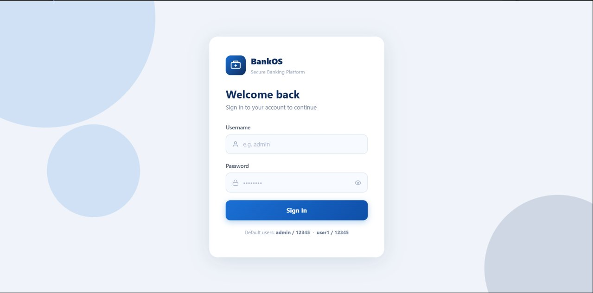
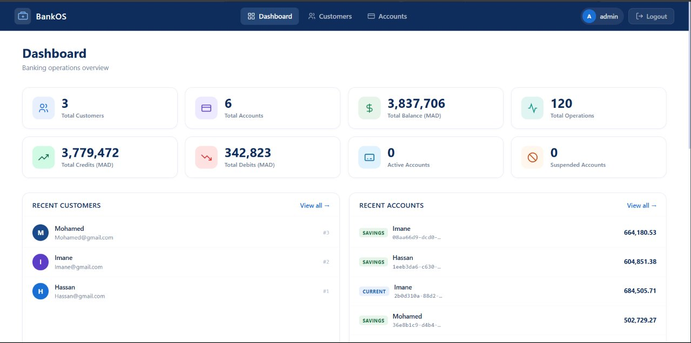
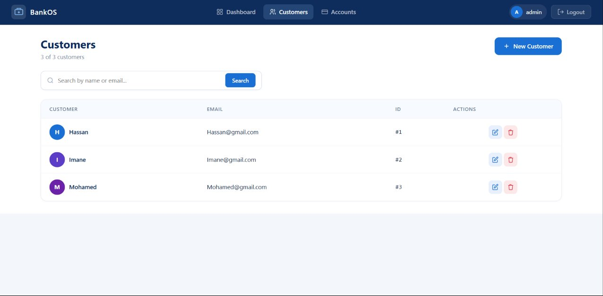
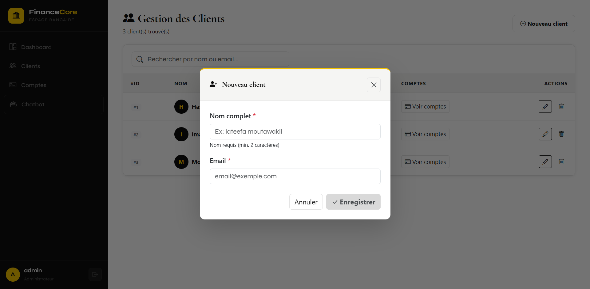
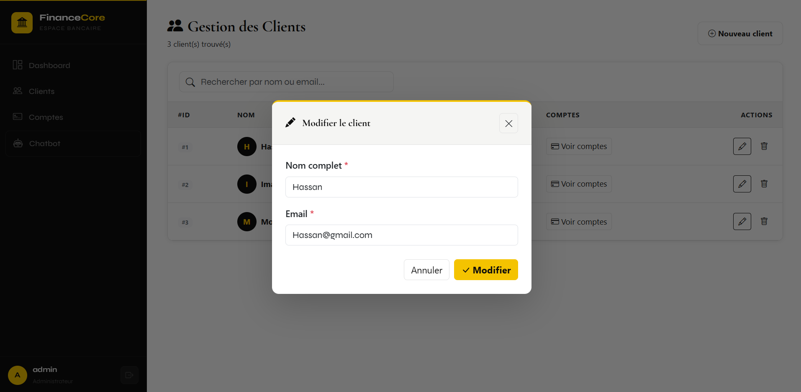
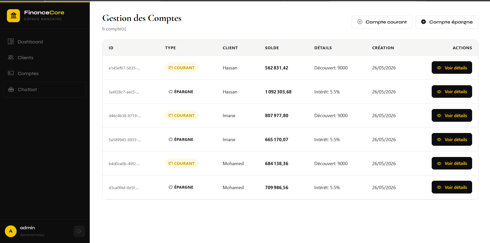
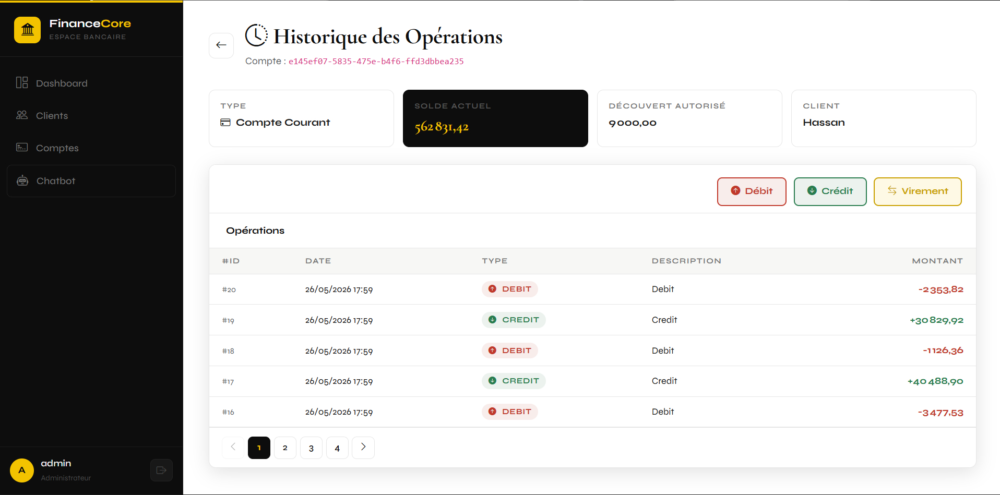
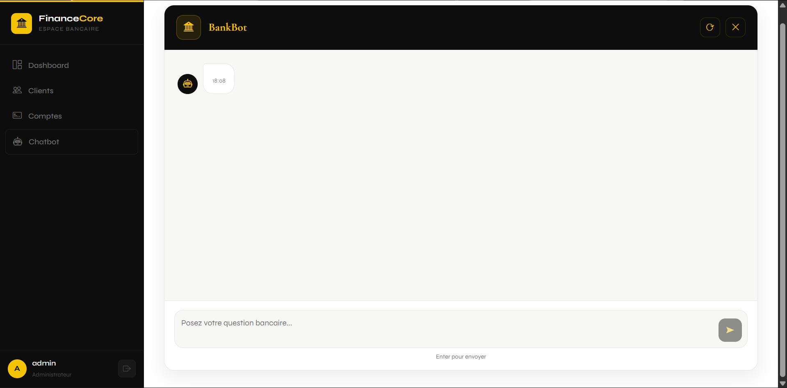

# BankOS — E-Banking Platform

A full-stack banking management application built with **Angular 17** (frontend) and **Spring Boot 3** (backend). It covers customer management, bank account operations, transaction history, fund transfers, and a live analytics dashboard — all secured with JWT authentication.

---

## Screenshots

### 🔐 Login

> Clean authentication screen with username/password fields, show/hide password toggle, and default credential hints.

---

### 📊 Dashboard

> At-a-glance overview: 8 KPI cards (customers, accounts, total balance, operations, credits, debits, active/suspended counts), recent customers feed, recent accounts feed, and account breakdown bars.

---

### 👥 Customers

> Full customer table with colored avatar initials, real-time search, server-side search on Enter, and inline edit/delete actions per row.

---

### ➕ New Customer

> Dedicated form with live preview card, validation, and auto-redirect to the customers list on success.

---

### ✏️ Edit Customer


---

### 🏦 Accounts

> Master–detail layout: filterable account cards on the left (by type and status), detail panel on the right showing balance, interest rate, and full paginated transaction history with color-coded DEBIT/CREDIT rows.

---

### 📄 Account Details


---

### 🤖 Chatbot Assistant


---

## Table of Contents

- [Tech Stack](#tech-stack)
- [Project Structure](#project-structure)
- [Getting Started](#getting-started)
  - [Backend Setup](#backend-setup)
  - [Frontend Setup](#frontend-setup)
- [Environment Configuration](#environment-configuration)
- [API Reference](#api-reference)
- [Features](#features)
- [Architecture](#architecture)
- [Authentication Flow](#authentication-flow)
- [Known Issues & Troubleshooting](#known-issues--troubleshooting)

---

## Tech Stack

| Layer | Technology |
|---|---|
| Frontend | Angular 17, TypeScript, RxJS |
| Backend | Spring Boot 3, Spring Security, Spring Data JPA |
| Database | MySQL / H2 (dev) |
| Auth | JWT (HS512) via Spring Security |
| Styling | Pure CSS (no framework) |
| HTTP | Angular HttpClient with functional interceptors |

---

## Project Structure

```
ebanking-backend/
└── src/main/java/ma/enset/ebankingbackend/
    ├── entities/
    │   ├── Customer.java
    │   ├── BankAccount.java             # abstract — SINGLE_TABLE inheritance
    │   ├── CurrentAccount.java          # discriminator "CA"
    │   ├── SavingAccount.java           # discriminator "SA"
    │   └── AccountOperation.java
    ├── dtos/
    │   ├── CustomerDTO.java
    │   ├── BankAccountDTO.java          # base (type field)
    │   ├── CurrentBankAccountDTO.java
    │   ├── SavingBankAccountDTO.java
    │   ├── AccountOperationDTO.java
    │   ├── AccountHistoryDTO.java
    │   ├── DebitDTO.java
    │   ├── CreditDTO.java
    │   ├── TransferRequestDTO.java
    │   └── DashboardDTO.java            # aggregated KPIs + recent items
    ├── services/
    │   ├── BankAccountService.java
    │   ├── BankAccountServiceImpl.java
    │   ├── DashboardService.java
    │   └── DashboardServiceImpl.java
    ├── web/
    │   ├── CustomerRestController.java  # /customers
    │   ├── BankAccountRestAPI.java      # /accounts
    │   └── DashboardRestController.java # /dashboard
    ├── repositories/
    │   ├── CustomerRepository.java
    │   ├── BankAccountRepository.java
    │   └── AccountOperationRepository.java
    └── enums/
        ├── AccountStatus.java           # CREATED | ACTIVATED | SUSPENDED
        └── OperationType.java           # DEBIT | CREDIT

ebanking-frontend/
└── src/app/
    ├── model/
    │   ├── customer.model.ts
    │   ├── account.model.ts
    │   └── dashboard.model.ts
    ├── services/
    │   ├── auth.service.ts
    │   ├── customer.service.ts
    │   ├── account.service.ts
    │   └── dashboard.service.ts
    ├── interceptors/
    │   └── auth.interceptor.ts          # attaches Bearer token — skips /auth/*
    ├── guards/
    │   └── auth.guard.ts                # redirects to /login when unauthenticated
    ├── login/
    ├── dashboard/
    ├── customers/
    ├── accounts/
    ├── new-customer/
    └── navbar/
```

---

## Getting Started

### Backend Setup

**Prerequisites:** Java 17+, Maven 3.8+, MySQL 8 (or H2 for development)

**1. Clone and configure**

```bash
git clone <repo-url>
cd ebanking-backend
```

Edit `src/main/resources/application.properties`:

```properties
# MySQL
spring.datasource.url=jdbc:mysql://localhost:3306/ebanking_db?createDatabaseIfNotExist=true
spring.datasource.username=root
spring.datasource.password=yourpassword
spring.jpa.hibernate.ddl-auto=update
spring.jpa.show-sql=true

# JWT
jwt.secret=YourSuperSecretKeyAtLeast64CharsLongForHS512!!
jwt.expiration=86400000

# Server
server.port=8080
```

**2. Run**

```bash
mvn spring-boot:run
```

API available at `http://localhost:8080`.

> **Default credentials:** `admin / 12345` and `user1 / 12345`

---

### Frontend Setup

**Prerequisites:** Node.js 18+, Angular CLI 17+

```bash
cd ebanking-frontend
npm install
ng serve
```

App opens at `http://localhost:4200`.

> To change the backend URL, update `baseUrl` in all four service files under `src/app/services/`.

---

## Environment Configuration

Base URLs are declared per service. For production:

```typescript
// e.g. src/app/services/account.service.ts
private baseUrl = 'https://api.yourdomain.com';
```

```bash
ng build --configuration production
```

---

## API Reference

### Auth

| Method | Endpoint | Description |
|---|---|---|
| `POST` | `/auth/login` | Returns JWT access token |

### Customers

| Method | Endpoint | Description |
|---|---|---|
| `GET` | `/customers` | List all customers |
| `GET` | `/customers/search?keyword=` | Search by name |
| `GET` | `/customers/{id}` | Get single customer |
| `POST` | `/customers` | Create customer |
| `PUT` | `/customers/{id}` | Update customer |
| `DELETE` | `/customers/{id}` | Delete customer |

### Accounts

| Method | Endpoint | Description |
|---|---|---|
| `GET` | `/accounts` | List all accounts |
| `GET` | `/accounts/{id}` | Get account by ID |
| `GET` | `/accounts/{id}/pageOperations?page=&size=` | Paginated transaction history |
| `POST` | `/accounts/saveCurrent?initialBalance=&overDraft=&customerId=` | Create current account |
| `POST` | `/accounts/saveSaving?initialBalance=&interestRate=&customerId=` | Create saving account |
| `POST` | `/accounts/debit` | Debit operation |
| `POST` | `/accounts/credit` | Credit operation |
| `POST` | `/accounts/transfer` | Transfer between accounts |

### Dashboard

| Method | Endpoint | Description |
|---|---|---|
| `GET` | `/dashboard` | All KPIs + recent customers, accounts, operations in one call |

---

## Features

### 🔐 Login
- JWT authentication, token stored in `localStorage`
- Show/hide password toggle
- Clear error messages on wrong credentials
- Auto-redirect when already authenticated
- Expired/corrupt token cleared automatically on startup

### 📊 Dashboard
- 8 live KPI cards — customers, accounts, total balance, operations, total credits, total debits, active accounts, suspended accounts
- Recent customers (last 5), recent accounts (last 5), recent transactions (last 8)
- Account type and status breakdown progress bars
- Credit vs. debit cash-flow split bar

### 👥 Customers
- Color-coded avatar initials, consistent per name
- Real-time local filter as you type, server-side search on Enter
- Edit modal with fields pre-filled from the database, animated slide-up
- Delete with confirmation, auto-refresh table after any change

### ➕ New Customer
- Live preview card rendered as you type
- Redirects to `/customers` automatically on success

### 🏦 Accounts
- Filter by type (Current / Saving) and status, search by ID or owner name
- Click a card to load detail — balance cards, overdraft limit or interest rate
- Paginated transaction history (5 per page)
- **Debit / Credit modals** — pre-filled with the selected account ID, red and green gradient headers respectively
- **Transfer modal** — both dropdowns fully populated from real accounts; destination list excludes the source and filters out non-activated accounts; preview chip shows type, owner, and balance after selection
- **New Account modal** — Current/Saving toggle, customer autocomplete with live dropdown, conditional overdraft or interest rate field, summary box before confirming

---

## Architecture

```
Browser
  │
  ├── authInterceptor     Adds Bearer token — skips /auth/login and /auth/register
  ├── authGuard           Redirects to /login if token absent or expired
  │
  ├── /login              POST /auth/login
  ├── /dashboard          GET  /dashboard
  ├── /customers          GET | POST | PUT | DELETE /customers
  ├── /new-customer       POST /customers
  └── /accounts           GET  /accounts  +  GET /customers
                          POST /accounts/debit
                          POST /accounts/credit
                          POST /accounts/transfer
                          POST /accounts/saveCurrent | /accounts/saveSaving

Spring Boot
  ├── Spring Security     Validates JWT on every request except /auth/**
  ├── CustomerRestController     → CustomerRepository
  ├── BankAccountRestAPI         → BankAccountRepository + AccountOperationRepository
  └── DashboardRestController    → all three repositories

MySQL
  ├── customers           id, name, email
  ├── bank_account        id, balance, created_at, currency, status, customer_id,
  │                       TYPE (CA/SA), overdraft, interest_rate   ← SINGLE_TABLE
  └── account_operation   id, operation_date, amount, type, description, bank_account_id
```

---

## Authentication Flow

```
1.  User submits credentials on /login
2.  POST /auth/login  →  { accessToken, username, roles }
3.  Token stored in localStorage
4.  authInterceptor attaches header on every subsequent call:
    Authorization: Bearer eyJhbGci...
5.  /auth/* URLs are whitelisted — never receive the token
6.  Spring Security validates JWT signature and expiry per request
7.  On logout → token removed, redirect to /login
8.  On app startup → expired or malformed token auto-cleared
```

---

